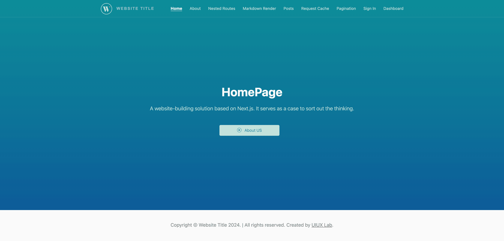

# Full-Stack Next.js Application Template

 This repository is a full-stack sample web application based on Next.js that creates a simple whole-website architecture, and provides the foundational services, components, and plumbing needed to get a basic web application up and running. 





## Table of Contents

* [Scheme](#scheme)
* [File Structures](#file-structures)
* [Getting Started](#getting-started)
* [Further Help](#further-help)
*  - [(💎 Incremental Guide) Migrating from Pages Router to App Router](#---incremental-guide-migrating-from-pages-router-to-app-router)
*  - [Deploy on Custom Server](#--deploy-on-custom-server)
*  - [Deploy on Custom Server](#--deploy-on-custom-server)
*  - [Node.js Port 3000 already in use but it actually isn't?](#--nodejs-port-3000-already-in-use-but-it-actually-isnt)
*  - [Change the Favicon](#--change-the-favicon)
*  - [Customize Menu](#--customize-menu)
*  - [Set port in next.js](#--set-port-in-nextjs)
*  - [Set basePath for a static exported](#--set-basepath-for-a-static-exported)
*  - [Site URL (Root Directory) Configurations](#--site-url-root-directory-configurations)
*  - [Deploy Using Docker (build a single next.js program image)](#--deploy-using-docker-build-a-single-nextjs-program-image)
*  - [Deploy Using Docker (Build composite image that include other custom images)](#--deploy-using-docker-build-composite-image-that-include-other-custom-images)
*  - [Deploy Using Docker (Common Load-balancing Solutions of Socket.io Issue)](#--deploy-using-docker-common-load-balancing-solutions-of-socketio-issue)
*  - [Installation Error or Unable To Run](#--installation-error-or-unable-to-run)
* [Contributing](#contributing)
* [Supported development environment](#supported-development-environment)
* [Changelog](#changelog)
* [Licensing](#licensing)


## Scheme

List my progress here:


| Function Block |  Supports  |
| --- | --- |
| 💎 Pages Router Demo Template | ✅  👉🏼 Enabling it requires renaming the folder [@pages](@pages) to `pages`, and deleting [app](app). |
| 💎 App Router Demo Template | ✅ 👉🏼 Default |
| 💎 Exporting Pure HTML Static Files (**.html**) | ✅  👉🏼 run `npm run export` and `npm run export:fix`|
| HTTP Navigation (SSR & Async) | ✅ |
| Multiple API Constructs | ✅ |
| Parameter Acquisition | ✅ |
| Pagination | ✅ |
| Basic Importing Methods for Components | ✅ |
| Authorization | ✅ |
| Login | ✅ |
| Network Requests | ✅ |
| API Demo | ✅ |
| CURD Demo | ✅ |
| JWT Demo | ✅ |
| File Import | ✅ |
| SEO Premium | ✅ |
| Static Pages | ✅ |
| Incremental Static Regeneration | ✅ |
| Remote Download | ✅ |
| Fully Static HTML Files Generation | ✅ |
| Custom Server | ✅ |
| Custom Hooks (auth, redux, draggable, keypress etc.) | ✅ |
| Frontend Page Interacts With Node | ✅ |
| Alias Support | ✅ |
| Local PHP Service Association | ✅ |
| Server Deployment | ✅ |
| Deploy Using Docker | ✅ |
| Redux Supplement (for navigation) | ✅ |
| Redux SSR (for homepage navigation) | ✅ |
| WebSocket Support via `socket.io` | ✅ |
| Additional Node.js Services | ✅ |
| Request Cache Demo | ✅ |
| Authentication of Microservices | ✅ |
| Markdown Render Demo | ✅ |
| Video stream demo (normal, encryption and decryption modes) | ✅ 👉🏼 Check out the Next API directory and [src/components/VideoPlayer](src/components/VideoPlayer) |
| NestJS Server Demo | ✅ 👉🏼 Go to the folder [backend@nest](backend@nest) |
| 🍗 Compress and optimize all files in a folder. | ⚠️ *unbundled* 👉🏼 [imgop](https://github.com/xizon/imgop) |
| 🍗 End-to-end typesafe API (gRPC) | ⚠️ *unbundled* 👉🏼 [gRPC Getting Started](https://github.com/xizon/grpc-getting-started) |
| 🍗 React UI Components Libraries | ⚠️ *unbundled* 👉🏼 [Funda UI](https://github.com/xizon/funda-ui) |
| 🍗 Nextjs Doc Template | ⚠️ *unbundled* 👉🏼 [Nextjs Doc Template](https://github.com/xizon/nextjs-doc-template) |


## File Structures


```sh
fullstack-nextjs-app-template/
├── README.md
├── CHANGELOG.md
├── LICENSE
├── next.config.js
├── server.js
├── ecosystem.config.js
├── middleware.ts
├── tsconfig.json
├── package-lock.json
├── package.json 
├── .dockerignore
├── Dockerfile
├── docker-compose.yml
├── out/                # Folder generated by export command which contains the HTML/CSS/JS assets for your application
├── backend@nest/       # NestJS server
├── backend/            # Express server
│   ├── server-php.js 
│   └── ...             # All other files are optional
├── scripts/            # Node Script Library
├── public/             # Contains static resources, PHP remote test files, .md files for markdown rendering, etc.
├── app/                # App Router Demo Template
├── @pages/             # Pages Router Demo Template (Enabling it requires renaming the folder `@pages` to `pages`, and deleting `app`.)
│   ├── api/
│   └── *.tsx
├── src/
│   ├── config/
│   ├── data/
│   ├── contexts/
│   ├── interfaces/
│   ├── components/
│   ├── styles/
│   ├── utils/
│   └── store/
└──
```

                   

